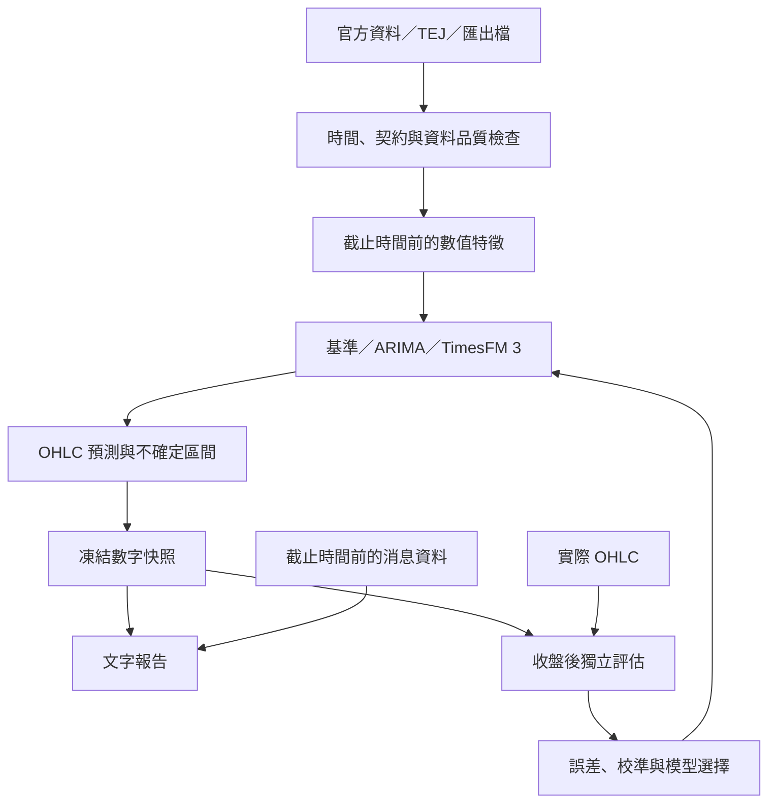

# 台股與台指期 OHLC 量化預測：架構重整方案

日期：2026-10-07。狀態：架構方案；尚未接入完整歷史資料、訓練模型或驗證準確率。

## 1. 已確認的方向

先由時間序列模型預測台灣加權指數及台指期的每日開盤、最高、最低、收盤，再以新聞、世界局勢與金融數據補充文字說明。TEJ 權限暫緩確認，資料層必須支援官方來源及匯出檔，之後可以更換為 TEJ。

新版角色：V1 是數字預測引擎；V0 是讀取 V1 結果的文字報告層。過去 V0 文字假說與 V1 情境紀錄保留為歷史研究資料，新舊模型的成績分開統計。消息先用於說明，之後有歷史資料及樣本外增益證據才加入數值模型。

## 2. 現況與需要改動的地方

已讀取現有 `fu06pi/tw-market-scenario-engine` 的 README、檔案樹、models.py、baselines.py、pyproject.toml。

- README 的研究目的仍是文字假說與 Bull/Base/Bear 情境的量化驗證。
- models.py 定義預測資料格式，並不是會學習的預測模型。
- baselines.py 的開盤方向基準使用固定的夜盤、SOX、ADR 權重。
- 已檢視的程式與依賴未提供 ARIMA、TimesFM 的訓練／推論流程；現況不能視為已完成 OHLC 模型。
- 快照、日期、版本及事後評估的概念可以沿用；數值目標、模型介面、回測及文字生成流程需要重整。

本方案尚未修改 GitHub 程式、Google Sheet 或既有排程。

## 3. 第一版預測任務與時間

預設沿用晨報用途：交易日 D 的早上，預測 D 日尚未開始的日盤 OHLC，預測期為一個交易日。

| 標的 | 正式目標 | 輸入與評分注意事項 |
|---|---|---|
| 加權指數 TAIEX | 集中市場日盤 O/H/L/C | 用證交所的指數 OHLC，不能以 ETF 或台指期價格代替 |
| 台指期 TX | 指定月份合約的日盤 O/H/L/C | C 使用日盤最後成交價，結算價另存，不能混為同一個欄位 |
| 台指期夜盤 | 第一階段作為輸入 | 已結束的夜盤 OHLC、成交量、與前一日盤的變化；另保留 session |

期交所公告台指期一般日盤為 08:45–13:45；到期合約最後交易日提早至 13:30。夜盤為 15:00–次日 05:00。[S3]

因此原本 08:50 截止不能直接沿用為台指期日盤開盤的預測截止點。建議第一版採兩個標的一致的 **08:30 資料截止、08:40 前完成數字存檔**；這是設計建議，尚未變更排程。資料延遲或存檔未完成時應明確標示失敗，不以開盤後補檔算成正式盤前樣本。

若未來要預測「包含已結束夜盤在內的整個交易日 OHLC」，那是部分已知資訊下的條件預測，必須另立任務與評分，不能混入日盤純預測。

## 4. 工作流程

模型調整只影響後續版本。已發布快照不回寫；文字報告透過 forecast_id 引用數字快照。新聞改版也不能修改當日的模型預測。

## 5. TEJ 暫緩時的資料替代方案

| 所需資料 | 第一階段來源 | TEJ 接入後的角色 |
|---|---|---|
| 加權指數歷史 OHLC | TWSE `MI_5MINS_HIST` 月報，可指定歷史月份 [S1] | 替換／交叉核對資料；先確認指數資料表及授權 |
| TX 合約日盤 OHLC | TAIFEX 期貨每日交易行情查詢／下載 [S2] | 確認合約及時段欄位，不能直接接受口徑不明的連續期貨 |
| TX 夜盤 OHLC | TAIFEX 同來源的盤後交易時段 [S2] | 驗證夜盤交易日歸屬與日盤分離 |
| 成交量、未平倉、結算價 | TAIFEX 行情；欄位各自保留 | 補充歷史深度及穩定更新 |
| 外部市場數值特徵 | 第二階段才按可取得的歷史來源加入 | 確認美股、匯率、利率等是否在實際授權範圍 |

以上是可行的來源路線，不表示已下載完整多年資料或確認自動下載穩定性。批次取資料要先測試歷史覆蓋、缺漏、服務限制與發布延遲。TEJ 使用官方 REST/Python 介面設計 adapter，但不能假設學校終端授權自動包含 API 權限。[S6]

第一階段優先建立 2018 年至最新完整交易日的候選樣本；實際起點以日盤、夜盤共同覆蓋及品質檢查結果為準。初期只用兩個市場自身的數值資料，避免外部資料未齊造成整個模型無法起步。

### 統一資料格式

每列至少包括 `instrument`、`contract_month`、`session`、`trading_date`、`session_start_at`、`session_end_at`、O/H/L/C、成交量、未平倉（若有）、結算價（若有）、`source`、`fetched_at`、`available_at`、`availability_basis`。

`available_at` 表示模型在當時可取得資料的時間；今天下載舊資料的時間不能代替歷史可用時間。若無發布時間紀錄，採明確保守延遲假設並標記來源，不假裝具有完整的歷史時點證據。

資料檢查：交易日重複、休市、價格非正值、H < max(O,C)、L > min(O,C)、合約／時段混雜、缺值、異常尺度與來源間差異。休市不補出虛構 K 棒；缺漏不能直接當成零報酬。

## 6. 台指期合約、換月與夜盤

- 保留每個月份合約原始行情，再依事前固定規則選擇預測合約。
- 第一版候選規則：到期前五個交易日起轉到次月合約；是否採用需在驗證集比較後固定，最終測試期不再變更。
- 換月日的參考收盤價使用「被選合約自己的前一日盤 C」。不能用舊合約前收與新合約當日開盤計算假跳空。
- 每個日子的衍生報酬先在同合約內計算，再拼成訓練序列。近月與次月基差另作特徵，換月日獨立檢查誤差。
- 若使用連續調整序列，要保存每次預測當時的版本，避免未來換月使過去資料被重新調整。
- 夜盤使用期交所交易量歸屬日期，不只看日曆日期；例如官方將前日下午至當日凌晨的夜盤歸於當日交易日。[S2]
- 08:30 模型可用已結束夜盤，不能使用 08:45 後的當日日盤行情。

## 7. OHLC 如何建模

先預測相對變化，再還原成點數。不要只把持續上升的指數水準餵進模型，最後用很低的百分比誤差宣稱很準。

對每個標的，以同標的／同合約前一日盤 C 為 P，定義：

| 潛在目標 | 定義 | 用途 |
|---|---|---|
| g | ln(O/P) | 隔夜到日盤開盤的跳空 |
| b | ln(C/O) | 當日日盤實體報酬 |
| u | ln(H/max(O,C))，≥ 0 | 上影線／向上延伸 |
| d | ln(min(O,C)/L)，≥ 0 | 下影線／向下延伸 |

模型對 u、d 採固定 epsilon 的對數非負轉換，反轉換後保持非負。還原公式：O=P×exp(g)，C=O×exp(b)，H=max(O,C)×exp(u)，L=min(O,C)×exp(-d)。這樣預測結果必須符合 K 棒幾何關係。

這是候選表示法，仍須和直接 OHLC 報酬預測加約束的方案比較；非負轉換與約束本身不代表會提高準確率。b 並不是 close-to-previous-close，收盤方向應使用 g+b 計算。

第一版兩市場各建一套模型；TimesFM 的聯合多變量版本為對照實驗，以判斷共享訊號是否有增益。

## 8. 模型比較順序

| 模型 | 任務 | 重要限制 |
|---|---|---|
| 簡單基準 | 零跳空／零實體＋過去波動估計的上下延伸；另加過去夜盤資訊的簡單回歸 | 所有參數由過去資料估計，作為最低比較標準 |
| ARIMA | 預測 g、b 及轉換後的 u、d | 作為可解釋、低成本的第一個模型 |
| ARIMAX／SARIMAX | 在上述目標加入已知夜盤報酬、區間、基差等外生變數 | 外生變數在每個歷史預測時點都必須可用 [S5] |
| TimesFM 3 | 使用同樣任務、截止點與特徵，比較單變量及多變量 | 預訓練模型、可輸出分位數，不代表台股必然更準 [S4] |
| 集成 | 只有驗證集顯示模型誤差互補才加權 | 權重只由過去驗證資料決定，不預設平均一定較好 |

ARIMA 初期只搜尋少量 p/q、差分及訓練視窗設定。市場日資料不因每週五個交易日就自動假設五日季節性。TimesFM 先測零樣本，不急著微調。

TimesFM 3 為 Google Research 已發布的正式版本，支援原生多變量、過去協變量、已知未來協變量及分位數輸出。已知未來協變量只能放行事曆／預定事件等事前確定資訊，不能放未公布數據的實際值。[S4]

下載的 TimesFM 3 權重有非商業、非正式營運的限制；本階段定位為研究比較。自動化正式服務前要採符合授權的部署路線或其他模型，不能把程式碼的 Apache-2.0 當成權重授權。[S4]

## 9. 預測區間與機率

每一個 O/H/L/C 輸出點估計及 80% 預測區間，保留模型原始分位數與校準後區間。

ARIMA 可從過去殘差估計不確定性；TimesFM 分位數仍須在台股樣本上驗證。g/b/u/d 的各自分位數不能直接套公式當成正確的 OHLC 聯合分位數。候選方法是以過去四維殘差向量取樣產生一致 OHLC，保留目標間相依，再檢查實際覆蓋率。

每個價位 80% 的邊際區間，不等於四個價位同時有 80% 覆蓋率；兩者分開記錄。模型若沒有校準的分布，先只發布點估計及經驗區間，不輸出看似精確的上漲機率。

## 10. 如何判斷有沒有做準

採逐日往前走的回測：每次只用截止點之前可用的資料，預測下一個日盤，收盤後才加入實際結果。先用較早資料訓練，再用後續一段選模型／校準，最後保留最近約一年做未參與選模的測試。日期與視窗以資料完整性確認後固定。

- 禁止隨機切分時間序列；標準化、缺值處理、特徵選擇、ARIMA 參數及集成權重都只由當時訓練／驗證資料決定。
- 基準與候選模型必須在完全相同日期、資訊截止點與目標上比較。模型失敗日要列出覆蓋率，不可靜默刪除難預測日。
- 加權指數與台指期分開報告；O/H/L/C 共八個主要誤差不能被一個平均分數掩蓋。
- 主要看各價位點數 MAE、相對同標的參考前收的 bp MAE；輔助看 RMSE、開盤 gap 誤差、收盤報酬誤差、日盤振幅誤差。
- 方向分類若保留，事前固定中性門檻，提供各類樣本數及混淆矩陣，不以一直猜上漲取得的命中率冒充增益。
- 區間用 pinball loss、interval score、80% 實際覆蓋率與平均寬度衡量；越寬並不代表越準。
- 模型誤差與基準的差異用保留時間相依的區塊抽樣估計不確定性；分高／低波動、換月、重大事件與不同年度檢查。
- 對 TimesFM 等預訓練模型，早期金融資料可能出現在預訓練中。若無法排除資料重疊，歷史回測只能標示為回溯比較；發布後新資料與真正盤前前向測試才提供更強證據。

候選上線門檻：兩市場 C 的樣本外 MAE 均優於各自基準；其他 O/H/L 不出現持續劣化；預測區間校準合理；跨月份有一致增益。改善幅度、可接受劣化及覆蓋率容許差需在最終測試前固定。這是驗收方式，不是已達成的成績或保證。

若候選模型沒有勝過基準，就保持基準為正式輸出，繼續研究；不能為了採用 TimesFM 而宣布它勝出。預測準確率與交易獲利分開評估；後者另需成交與成本假設。

## 11. 文字報告規則

先引用模型版本、預測日期、標的／合約、OHLC 與區間，再說明預期跳空、日盤實體與振幅。消息段落分別呈現支持因素、相反訊號及可能使預測失準的事件，保留來源與發布時間。

- 第一階段消息只負責背景與風險說明，不修改模型點數或機率。
- 區分「模型輸入的數值訊號」與「沒有進模型的新聞背景」，避免把新聞描述成模型得出數字的原因。
- 數字、合約及方向自動從 forecast_id 讀取，不讓文字模型自行填入另一套數字。
- 只有日 OHLC 不能辨識高低點的發生順序，文字不能宣稱模型預測先攻後回、gap-fade 或尾盤拉升。路徑研究須另接分 K 資料。
- 第二階段將新聞做成有時間戳的情緒、事件類別或驚喜程度特徵；使用歷史當時版本，做有／無消息特徵的對照後才採用。

## 12. 建議程式模組與輸出

| 模組 | 職責 |
|---|---|
| providers/twse、taifex、tej、csv | 取數、格式轉換，保留來源與版本 |
| data/calendar、sessions、contracts | 交易日、夜盤歸屬、換月與相同合約參考價 |
| features/asof、ohlc_targets | 截止時間過濾、數值特徵與目標轉換 |
| forecasters/naive、arima、arimax、timesfm3 | 同一 fit/predict 介面與失敗狀態 |
| forecasting/coherence、calibration | OHLC 約束、區間與方向校準 |
| backtest/walk_forward、metrics | 時序驗證、八項主要誤差與基準增益 |
| snapshots、registry | 資料、模型、程式、參數與發布證據 |
| narrative/context、render | 消息資料及引用數值的文字報告 |

數字快照至少包含 target_date、instrument、contract_month、session、issued_at、data_cutoff、資料清單 hash、模型與程式版本、reference_close、OHLC 點估計／區間、校準版本、資料品質、持久化完成時間。固定同一套 canonical hash 規則；hash 只能證明內容一致，盤前發布還需要可信的存檔時間證據。

V0 的 Google Sheet 未來改讀 forecast_id、模型 OHLC、文字解釋及實際 OHLC／誤差；既有舊資料保持原始口徑並標示 legacy。完成新模型驗證及排程端到端測試後，才切換每日正式工作。

## 13. 執行順序與目前完成度

1. **本次已完成**：確認兩標的 OHLC、消息用途與 TEJ 暫緩；核對舊專案；提出時間、來源、合約、目標、模型比較及驗收架構。
2. **資料工程**：驗證官方歷史下載，建立同口徑日盤／夜盤、合約與時間戳，產出缺漏報告。
3. **可運行基準與 ARIMA**：完成同一 OHLC 介面、逐日回測與八項誤差報告。
4. **TimesFM 3 對照**：固定權重版本，與 ARIMA 比較相同資訊集，再測多變量及外生數值特徵。
5. **模型選擇與校準**：依驗證集選擇；最終測試與盤前前向測試分開報告，不事後重選。
6. **文字與排程整合**：凍結數字後生成敘述，確認盤前成功存檔與收盤資料更新，再遷移新角色。
7. **TEJ 與消息增益**：權限確認後替換資料 adapter；有可回測消息資料後才研究數值增益。

下一個可驗收成果應是「兩標的的歷史資料品質報告＋基準與 ARIMA 逐日回測結果」。目前沒有足夠資料宣稱模型已做準。

## 來源

來源檢查日期：2026-10-07。來源的模型功能與資料口徑描述不等同本方案的實測結果。

- [S1] [TWSE 指數歷史 OHLC](https://www.twse.com.tw/indicesReport/MI_5MINS_HIST?date=20170524&response=html)
- [S2] [TAIFEX 期貨每日交易行情與夜盤歸屬說明](https://www.taifex.com.tw/cht/3/futDailyMarketReport)
- [S3] [TAIFEX 臺股期貨契約規格](https://www.taifex.com.tw/cht/2/tX?menuid1=12)
- [S4] [TimesFM 官方程式與權重授權說明](https://github.com/google-research/timesfm)；[Google Research TimesFM 3 發布說明](https://research.google/blog/timesfm-3-a-zero-shot-foundation-model-for-multivariate-forecasting/)
- [S5] [statsmodels SARIMAX 文件](https://www.statsmodels.org/stable/generated/statsmodels.tsa.statespace.sarimax.SARIMAX.html)
- [S6] [TEJ API 文件](https://api.tej.com.tw/documents.html)
- [S7] [現有專案](https://github.com/fu06pi/tw-market-scenario-engine)
